# Computer Organization and Operating System Lab #11

# Section 0: Introduction

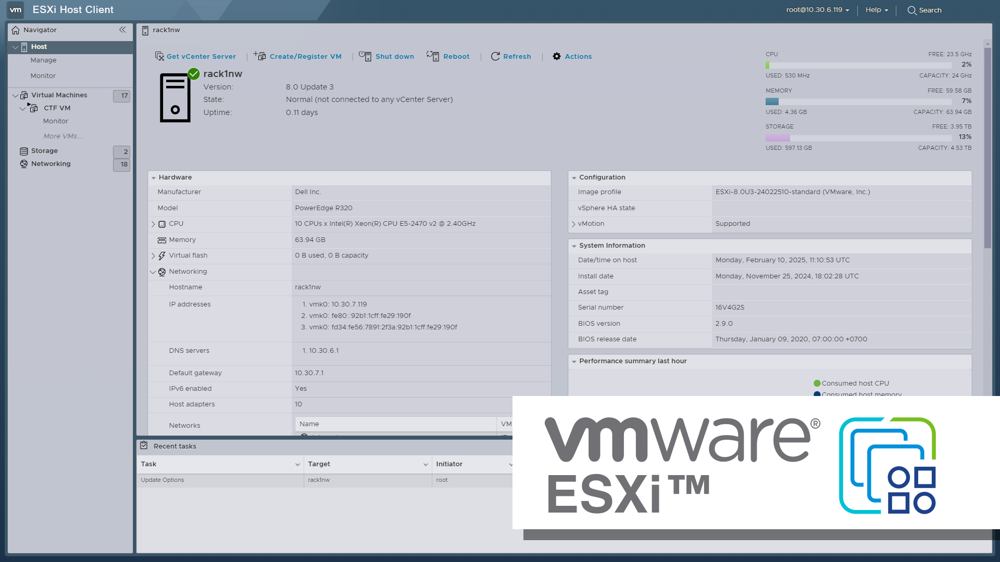

### **VMware ESXi คืออะไร**

- **Type-1 Hypervisor (Bare-Metal Hypervisor):** ESXi เป็นซอฟต์แวร์ที่ติดตั้งและทำงานบนฮาร์ดแวร์โดยตรง (directly on the physical server hardware) ไม่ต้องมีระบบปฏิบัติการหลัก (host OS) เหมือน Type-2 Hypervisor (เช่น VMware Workstation) ทำให้มีประสิทธิภาพสูงและใช้ทรัพยากรน้อยกว่า
- **Virtualization Platform:** ESXi ทำหน้าที่สร้างและจัดการ Virtual Machines (VMs) หลาย ๆ ตัวบนเซิร์ฟเวอร์กายภาพเครื่องเดียว ทำให้สามารถรันระบบปฏิบัติการและแอปพลิเคชันที่แตกต่างกันบนฮาร์ดแวร์เดียวกันได้อย่างอิสระ

### **ฟีเจอร์หลัก (Key Features)**

1. **Resource Abstraction & Sharing:** ESXi จะ "abstract" ทรัพยากรฮาร์ดแวร์ (CPU, memory, storage, network) และแบ่งสรรให้แต่ละ VM ใช้งานได้อย่างมีประสิทธิภาพ
2. **Isolation:** แต่ละ VM ทำงานแยกจากกันอย่างสมบูรณ์ (isolated environment) หาก VM หนึ่งมีปัญหา จะไม่กระทบ VM อื่น ๆ
3. **Centralized Management (vCenter Server):** แม้ ESXi จะทำงานได้ด้วยตัวเอง แต่โดยทั่วไปจะใช้ร่วมกับ vCenter Server เพื่อให้สามารถบริหารจัดการ ESXi hosts และ VMs หลาย ๆ ตัวได้จากศูนย์กลาง (centralized management)

4. **High Availability & Fault Tolerance (with vCenter):** สามารถทำ High Availability (HA) เพื่อให้ VM ย้ายไปทำงานบน host อื่นได้อัตโนมัติเมื่อ host หลักมีปัญหา และ Fault Tolerance (FT) เพื่อให้ VM มีสำเนาทำงานพร้อมกันบน host อื่นตลอดเวลา
5. **vMotion (with vCenter):** ย้าย VM ที่กำลังทำงานอยู่ (live migration) จาก ESXi host หนึ่งไปยังอีก host หนึ่งได้โดยไม่มี downtime (zero downtime)

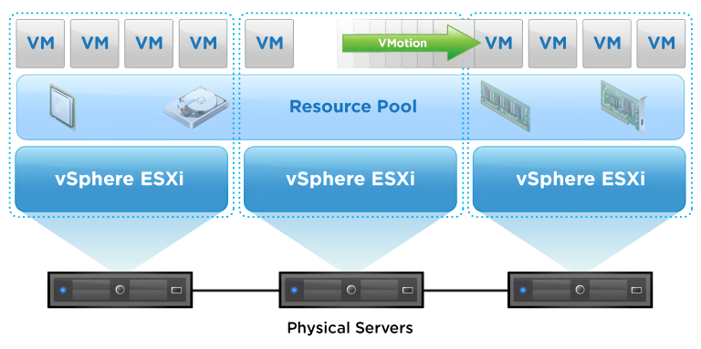

# Section 1: Preparation

> [!WARNING]
>⚠️**<ins>หมายเหตุ</ins>** ESXi ไม่รองรับสถาปัตยกรรม ARM ดังนั้น Apple Silicon ไม่สามารถใช้งานได้

## Prerequisite - ข้อกำหนดเบื้องต้น
- ต้องมี VMware Workstation ติดตั้งอยู่บนเครื่อง หากไม่มีให้ Download และติดตั้งจากที่นี่
    - [Workstation Pro 17.6.1 for Windows](https://fs-bucket.jarukrit.net/Bootcamp/VMware-workstation-full-17.6.1-24319023.exe)
    - [Workstation Pro 17.6.1 for Linux](https://fs-bucket.jarukrit.net/Bootcamp/VMware-Workstation-Full-17.6.1-24319023.x86_64.bundle)
    - [Fusion Pro 13.6.1 for macOS](https://fs-bucket.jarukrit.net/Bootcamp/VMware-Fusion-13.6.1-24319021_universal.dmg)
    - **ตอนเปิดใช้งานครั้งแรกอย่าลืมเลือก** ✅ Use VMware Workstation 17 for Personal Use สำหรับ Windows/Linux ✅ I want to license VMware Fusion 13 Pro for Personal use. สำหรับ macOS
- ตรวจสอบว่าสามารถใช้งาน Nested Virtualization ด้วยการเปิด `msinfo32` จากสามารถเปิด โดยการค้นหาจาก Start Menu 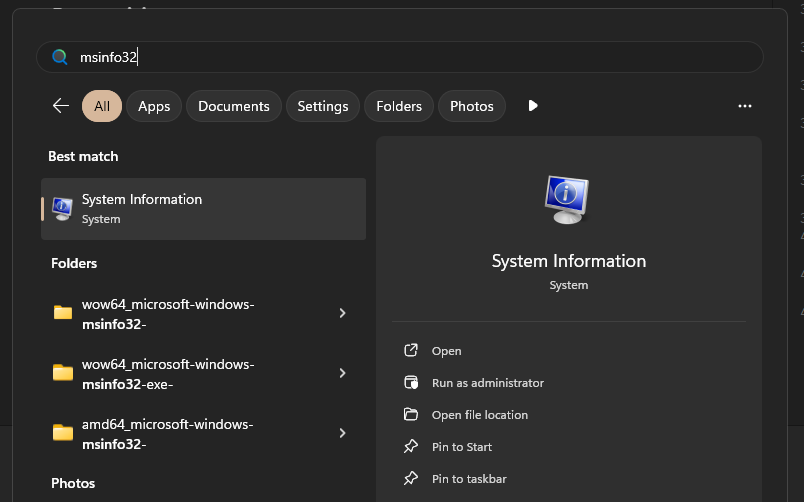 จากนั้นตรวจสอบว่า Virtualization-based security เป็น `Not enabled` หรือไม่
  หากพบว่ายังเป็น `Running` 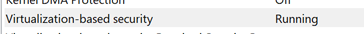 ให้ใช้ [Batch Script นี้](./scripts/TurnOffHyperV.bat)ในการ Disable โดยจะต้อง Reboot เครื่องเมื่อทำการใช้งาน Script เสร็จแล้ว

## Installation - การติดตั้ง

1. เริ่มต้นด้วยการ Download ไฟล์ติดตั้ง VMware ESXi โดยสามารถ Download ได้จากที่นี่
    - [VMware VMvisor Installer 8.0U3b.iso](https://fs-bucket.jarukrit.net/ESXi/VMware-VMvisor-Installer-8.0U3b-24280767.x86_64.iso)
2. สร้าง Virtual Machine โดยใช้ VMware Workstation เลือก `New Virtual Machine...` 
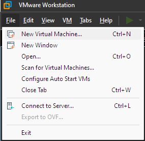
3. เลือก `Typical (recommended)`
 
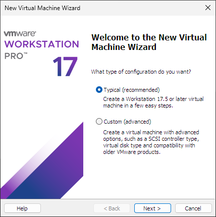
3. เลือก Install disc image file เป็นไฟล์ ISO ของ ESXi ที่ได้ Download มา 
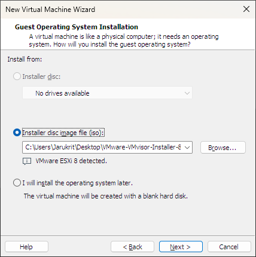
4. ตั้งชื่อ VM เป็นรูปแบบ `รหัสนักศึกษา-ESXi` เช่น 66070999-ESXi 
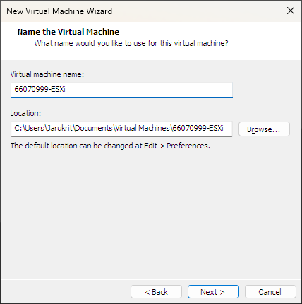
5. ใช้ค่า Disk Size ที่กำหนดมาให้ คือ 142.0 GB (VMware จะไม่ใช้พื้นที่จำนวนนั้นทันที่ เพราะเป็นการ Allocate แบบ Dynamic ใช้พื้นที่แค่เท่าที่ VM นั้น ๆ ใช้) 
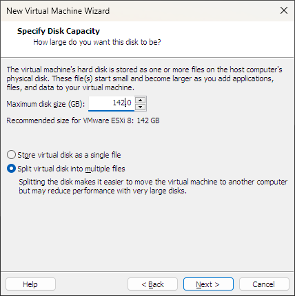
6. เมื่อมาถึงหน้า Summary แล้วเลือก `Customize Hardware...` เพื่อปรับประสิทธิภาพให้ดียิ่งขึ้น 
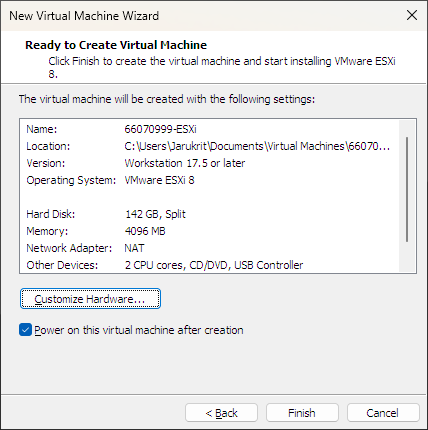
7. ปรับค่า Memory เป็น 8 GB (คอมในห้อง Lab มี RAM 16 GB) 
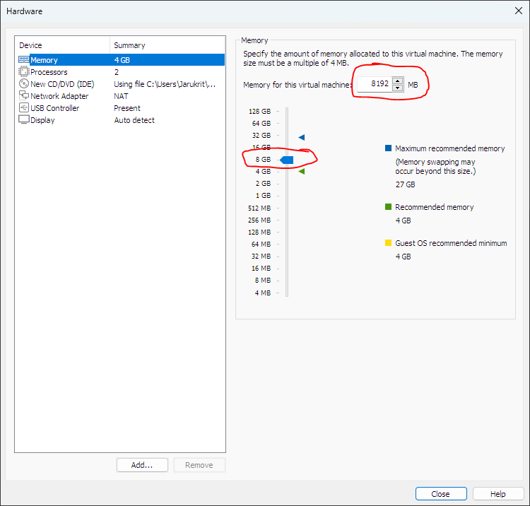
8. ปรับค่า Processors เป็น 1 Processors 6 Cores

    > [!IMPORTANT]
    > ต้องเปิดการตั้งค่า Virtualize Intel VT-x/EPT or AMD-V/RVI ไม่งั้น ESXi จะไม่สามารถทำงานได้

    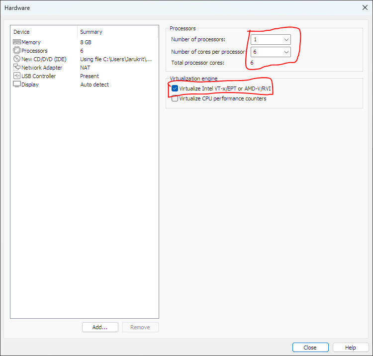

9. กด Close และกด Finish

10. หากเปิด VM แล้วพบ Error นี้ ให้เลือก No แล้วกลับไปทำขั้นตอน [Prerequisite - ข้อกำหนดเบื้องต้น](#prerequisite---ข้อกำหนดเบื้องต้น) ใหม่ 
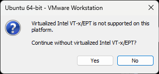