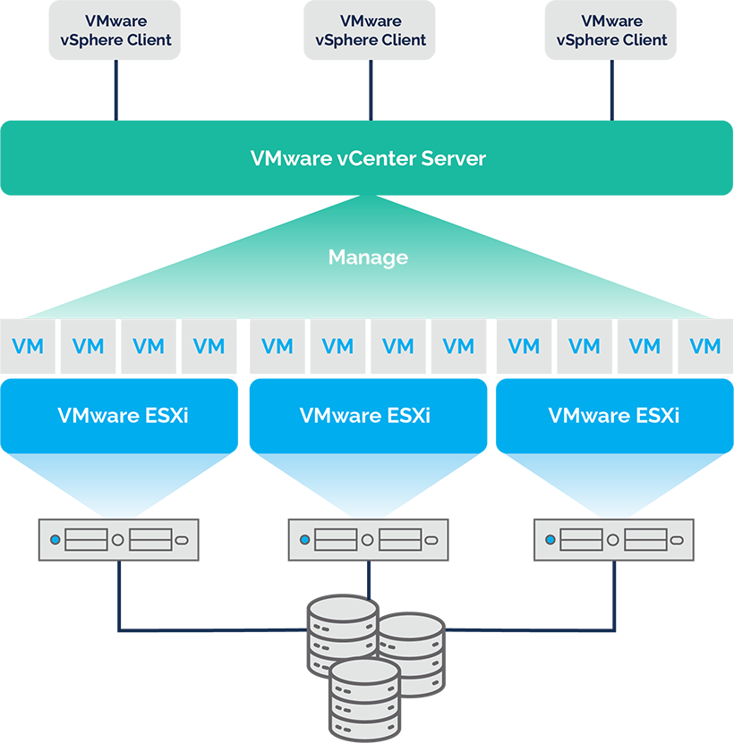

# Computer Organization and Operating System Lab #11

# Section 0: Introduction

### **VMware ESXi คืออะไร**

- **Type-1 Hypervisor (Bare-Metal Hypervisor):** ESXi เป็นซอฟต์แวร์ที่ติดตั้งและทำงานบนฮาร์ดแวร์โดยตรง (directly on the physical server hardware) ไม่ต้องมีระบบปฏิบัติการหลัก (host OS) เหมือน Type-2 Hypervisor (เช่น VMware Workstation) ทำให้มีประสิทธิภาพสูงและใช้ทรัพยากรน้อยกว่า
- **Virtualization Platform:** ESXi ทำหน้าที่สร้างและจัดการ Virtual Machines (VMs) หลาย ๆ ตัวบนเซิร์ฟเวอร์กายภาพเครื่องเดียว ทำให้สามารถรันระบบปฏิบัติการและแอปพลิเคชันที่แตกต่างกันบนฮาร์ดแวร์เดียวกันได้อย่างอิสระ

### **ฟีเจอร์หลัก (Key Features)**

1. **Resource Abstraction & Sharing:** ESXi จะ "abstract" ทรัพยากรฮาร์ดแวร์ (CPU, memory, storage, network) และแบ่งสรรให้แต่ละ VM ใช้งานได้อย่างมีประสิทธิภาพ
2. **Isolation:** แต่ละ VM ทำงานแยกจากกันอย่างสมบูรณ์ (isolated environment) หาก VM หนึ่งมีปัญหา จะไม่กระทบ VM อื่น ๆ
3. **Centralized Management (vCenter Server):** แม้ ESXi จะทำงานได้ด้วยตัวเอง แต่โดยทั่วไปจะใช้ร่วมกับ vCenter Server เพื่อให้สามารถบริหารจัดการ ESXi hosts และ VMs หลาย ๆ ตัวได้จากศูนย์กลาง (centralized management)

4. **High Availability & Fault Tolerance (with vCenter):** สามารถทำ High Availability (HA) เพื่อให้ VM ย้ายไปทำงานบน host อื่นได้อัตโนมัติเมื่อ host หลักมีปัญหา และ Fault Tolerance (FT) เพื่อให้ VM มีสำเนาทำงานพร้อมกันบน host อื่นตลอดเวลา
5. **vMotion (with vCenter):** ย้าย VM ที่กำลังทำงานอยู่ (live migration) จาก ESXi host หนึ่งไปยังอีก host หนึ่งได้โดยไม่มี downtime (zero downtime)

# Section 1: Preparation

