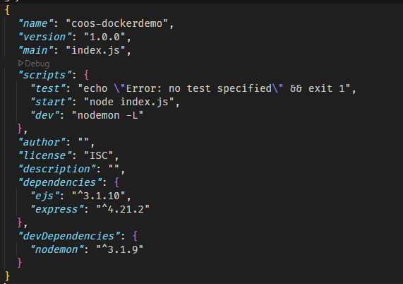

# Computer Organization and Operating System Lab #12

# Section 0: Introduction

## What is Docker


**Docker** เป็นแพลตฟอร์มที่ใช้สำหรับการสร้าง (build), จัดการ (manage), และรัน (run) แอปพลิเคชันในรูปแบบของ "คอนเทนเนอร์" (Container) คอนเทนเนอร์คือหน่วยที่รวมโค้ดของแอป, ไลบรารี, การตั้งค่า และทุกอย่างที่จำเป็นสำหรับการรันแอปนั้นเข้าไว้ด้วยกัน โดยทำงานบนระบบปฏิบัติการ (OS) เดียวกับเครื่องแม่ (host) ทำให้เบาและเร็วกว่าเครื่องเสมือน (Virtual Machine หรือ VM)

เปรียบเทียบง่าย ๆ: Docker เหมือนกล่องที่ใส่ทุกอย่างที่แอปต้องการ (โค้ด, เครื่องมือ, การตั้งค่า) แล้วยกไปรันที่ไหนก็ได้ โดยไม่ต้องกังวลว่าเครื่องนั้นจะต่างกัน

## What is Docker-Compose


**Docker Compose** เป็นเครื่องมือที่ช่วยให้เราจัดการแอปพลิเคชันที่มีหลายคอนเทนเนอร์ได้สะดวกขึ้น แทนที่จะต้องรันคอนเทนเนอร์ทีละตัวด้วยคำสั่งแยกกัน (เช่น docker run) เราสามารถเขียนไฟล์กำหนดค่าชื่อ docker-compose.yaml เพื่อระบุว่าต้องการคอนเทนเนอร์อะไรบ้าง, ตั้งค่าอย่างไร, และเชื่อมโยงกันยังไง จากนั้นใช้คำสั่งเดียว (เช่น docker-compose up) ก็รันทุกอย่างพร้อมกันได้เลย

เปรียบเทียบง่าย ๆ: ถ้า Docker เหมือนเชฟที่ทำอาหารจานเดี่ยว, Docker Compose เหมือนผู้จัดการร้านที่ดูแลให้ทุกจานออกมาพร้อมกันเป็นชุดใหญ่ เช่น มีทั้งซุป, ของหลัก, และของหวานในมื้อเดียว
## What is .YAML

**YAML** (ย่อมาจาก "YAML Ain’t Markup Language") เป็นรูปแบบไฟล์ที่ออกแบบมาให้มนุษย์อ่านและเขียนได้ง่าย ใช้สำหรับกำหนดข้อมูลหรือการตั้งค่าในลักษณะที่เป็นโครงสร้าง (structured data) โดยไม่ซับซ้อนเหมือน JSON หรือ XML โครงสร้างของ YAML ใช้การเยื้อง (indentation) ด้วยช่องว่าง (space) เพื่อแยกส่วนต่าง ๆ แทนการใช้วงเล็บหรือเครื่องหมายเยอะ ๆ

ไฟล์ docker-compose.yaml มีโครงสร้างหลัก ๆ ที่ใช้กำหนดการทำงานของ Docker Compose โดยทั่วไปจะประกอบด้วยส่วนสำคัญดังนี้:

### version (Optional)
```yaml
version: '3'
```

#### อธิบาย: 

- ระบุเวอร์ชันของ Docker Compose ที่ใช้ (เช่น '3', '3.8') เพื่อให้ Docker รู้ว่ารูปแบบไฟล์นี้เข้ากันได้กับฟีเจอร์ไหนบ้าง

#### ทำไมต้องมี: 
- เวอร์ชันต่าง ๆ รองรับคำสั่งและฟีเจอร์ต่างกัน ถ้าไม่ระบุจะใช้เวอร์ชันเก่าสุด (อาจทำให้บางฟีเจอร์ใช้ไม่ได้)

#### หมายเหตุ: 
- ปัจจุบันแนะนำให้ใช้เวอร์ชันล่าสุด เช่น '3.8' หรือสูงกว่า (ขึ้นอยู่กับ Docker ที่ติดตั้ง)


### service (Require)

```yaml
services:
  web:
    image: nginx
    ports:
      - "80:80"
  db:
    image: mysql
    environment:
      - MYSQL_ROOT_PASSWORD=secret
      - COMPOSE_PROJECT_NAME
    command: echo "I'm running ${COMPOSE_PROJECT_NAME}"
```

#### อธิบาย: 
- ส่วน services เป็นส่วนหลักที่กำหนดคอนเทนเนอร์แต่ละตัว (เรียกว่า "service") ที่เราต้องการให้ Docker Compose สร้างและจัดการ

#### โครงสร้างย่อย:
- `web` : คอนเทนเนอร์ที่รัน Nginx (เว็บเซิร์ฟเวอร์) และเปิดพอร์ต 80
- `image` : ระบุภาพ (image) ที่ใช้สร้างคอนเทนเนอร์ (เช่น Nginx, MySQL)
- `ports` : เชื่อมพอร์ต 80 ของเครื่องแม่ (host) กับพอร์ต 80 ของคอนเทนเนอร์
- `db` : คอนเทนเนอร์ที่รัน MySQL และตั้งรหัสผ่าน root เป็น "secret"
- `environment` : กำหนดตัวแปรสภาพแวดล้อม (environment variables) ให้กับคอนเทนเนอร์
- `command` : กำหนดคำสั่งที่ต้องการให้คอนเทนเนอร์รันเมื่อเริ่มต้น

### ส่วนเสริมอื่น ๆ (Optional) example: volumes, networks, depends_on
```yaml
version: '3.8'
services:
  web:
    image: nginx:latest
    ports:
      - "80:80"
    volumes:
      - web-data:/usr/share/nginx/html
    networks:
      - app-network
    depends_on:
      - app

  app:
    image: node:18
    working_dir: /app
    volumes:
      - ./src:/app
    command: npm start
    networks:
      - app-network
    depends_on:
      - db

  db:
    image: mysql:8.0
    environment:
      - MYSQL_ROOT_PASSWORD=secret
      - MYSQL_DATABASE=myapp_db
    volumes:
      - db-data:/var/lib/mysql
    networks:
      - app-network

volumes:
  web-data:
  db-data:

networks:
  app-network:
    driver: bridge
```
- `volumes` : ใช้เชื่อมโฟลเดอร์ระหว่างเครื่องแม่กับคอนเทนเนอร์ (คล้าย -v ใน docker run)
- `networks` : กำหนดเครือข่ายเพื่อให้คอนเทนเนอร์สื่อสารกันได้
- `depends_on` : ระบุว่า service นี้ต้องรอ service อื่นเริ่มก่อน


# Section 1: Preparation

## Install Docker Desktop
- [Docker Desktop for Window-x86_64](https://docs.docker.com/desktop/setup/install/windows-install/)
- [Docker Desktop for MacOS](https://docs.docker.com/desktop/setup/install/mac-install/)
- [Docker Desktop for Linux](https://docs.docker.com/desktop/setup/install/linux/)

## Install Node.js
- [Node.js](https://nodejs.org/en/download)

## Set Up 

### Docker Desktop
1.  Run Docker Desktop Installer.exe

### Node.js


#### Check Node.js Version
```bash
  node -v
```


#### Check NPM Version
```bash
  npm -v
```


## Section 2: Docker Basics

### 1. Create package.json


### 2. Install Express.js
```bash
  npm i express@latest
```

### 3. Create index.js
```javascript
  const express = require('express');
  const app = express();
  const port = 3000;

  app.get('/', (req, res) => {
    res.send('Hello World!');
  });

  app.listen(port, () => {
    console.log(`Example app listening at http://localhost:${port}`);
  });
```
### 4. Run Node.js Application
```bash
  node index.js
```


### Add script to package.json


### Run Node.js Application with NPM
```bash
  npm run start
```


### 5. Create Dockerfile


#### อธิบาย:
```dockerfile
FROM node:alpine
```
ใช้ภาพพื้นฐาน (image) ของ Node.js เวอร์ชัน alpine ซึ่งเบาและเล็ก

```dockerfile
WORKDIR /app
```
กำหนดโฟลเดอร์ทำงานในคอนเทนเนอร์เป็น /app

```dockerfile
COPY package.json . 
```
คัดลอก package.json จากเครื่องเราไปที่ /app ในคอนเทนเนอร์

```dockerfile
RUN npm install
```
ติดตั้ง dependencies (เช่น Express) ในคอนเทนเนอร์

```dockerfile
EXPOSE 3000
```
เปิดพอร์ต 3000 ในคอนเทนเนอร์

```dockerfile
CMD ["npm", "run", "start"]
```
คำสั่งเริ่มต้นเมื่อคอนเทนเนอร์รัน โดยเรียก npm run start

### 6. Create .dockerignore


#### อธิบาย:
`
node_modules/
`
ไม่คัดลอก node_modules ไปยังคอนเทนเนอร์

### 7. Build Docker Image


#### อธิบาย:
`
docker build -t [image-name]:[tag-name] .
`

สร้าง Docker image จาก Dockerfile

`-t myapp:v1` ตั้งชื่อ image ว่า myapp และเวอร์ชัน v1

`.` บอกให้ใช้ไฟล์ในโฟลเดอร์ปัจจุบัน (ที่มี Dockerfile)


เช็คว่า Image ถูกสร้างขึ้นมาหรือยัง


#### or


### 8. Run Docker Container


#### อธิบาย:
`
docker run --name [name] [image-name]
`
สร้างและรันคอนเทนเนอร์จาก image ที่เราสร้างไว้


หน้าเว็บไม่สามารถเข้าถึงได้เพราะเรายังไม่ได้เปิดพอร์ต 3000 ในคอนเทนเนอร์

### 9. Expose Port


`docker run -p [computer-port]:[container-port] [image-name-with-tag]` บอกให้เปิดพอร์ต 4000 ในเครื่องเรา และเชื่อมกับพอร์ต 3000 ในคอนเทนเนอร์

### 10. แสดง Container ที่กำลังทำงานอยู่


`docker ps` แสดง Container ที่กำลังทำงานอยู่

`docker ps -a` แสดง Container ทั้งหมด

### 10. เปลี่ยน index.js and Rebuild Docker Image


### 11. Stop Container


`docker stop [container-name]` หยุด Container ที่กำลังทำงานอยู่

### 12. Remove Container


`docker rm [container-name]` ลบ Container ที่หยุดทำงานอยู่

### 13. Run Docker Container with New Image


### 14. Mount Volume
`
docker run -v $(pwd):[path-WORKDIR] -v $(pwd):[path-WORKDIR]/node_modules
`

`$(pwd)` คือคำสั่งที่ใช้ในการแสดงตำแหน่งปัจจุบันของไฟล์ หรือ Working Directory ของเรา

`[path-WORKDIR]` คือตำแหน่งที่เราต้องการ mount ไปที่ Container


***Command Prompt อาจจะไม่ไม่ได้***

### 15. คำสั่งที่ใช้ในการเข้าไปทำงานใน Container


`docker exec -it [container-name] sh` เข้าไปทำงานใน Container ด้วย sh

### 16. แก้ insatll nodemon and add script to package.json (ไม่แน่ใจว่า ทำไม่ได้เพราะมันไม่ได้อยู่ใน devdependencies) หรือ คอมเรา


### 17. สร้าง Dockerfile.dev


### 18. Build Docker Image with Dockerfile.dev


### 19. Stop All Container And Delete All Container


```bash
docker stop $(docker ps -aq)
docker rm $(docker ps -aq)
```

### 20. Run Docker Container with myapp:v3


