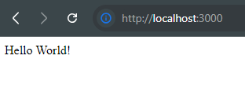

# Computer Organization and Operating System Lab #13

# Section 0: Introduction

## What is Docker


**Docker** เป็นแพลตฟอร์มที่ใช้สำหรับการสร้าง (build), จัดการ (manage), และรัน (run) แอปพลิเคชันในรูปแบบของ "คอนเทนเนอร์" (Container) คอนเทนเนอร์คือหน่วยที่รวมโค้ดของแอป, ไลบรารี, การตั้งค่า และทุกอย่างที่จำเป็นสำหรับการรันแอปนั้นเข้าไว้ด้วยกัน โดยทำงานบนระบบปฏิบัติการ (OS) เดียวกับเครื่องแม่ (host) ทำให้เบาและเร็วกว่าเครื่องเสมือน (Virtual Machine หรือ VM)

เปรียบเทียบง่าย ๆ: Docker เหมือนกล่องที่ใส่ทุกอย่างที่แอปต้องการ (โค้ด, เครื่องมือ, การตั้งค่า) แล้วยกไปรันที่ไหนก็ได้ โดยไม่ต้องกังวลว่าเครื่องนั้นจะต่างกัน


# Section 1: Preparation

## เปิด WSL 2 และ Hyper-V

### &nbsp;&nbsp;&nbsp;✨ให้ใช้ [&nbsp; Batch Script นี้&nbsp;](./scripts/TurnOnHyperV.bat)ในการ เปิด WSL 2 และ Hyper-V โดยจะต้อง Reboot เครื่องเมื่อทำการใช้งาน Script เสร็จแล้ว


## ติดตั้ง Docker Desktop
- [Docker Desktop for Window-x86_64](https://docs.docker.com/desktop/setup/install/windows-install/)
- [Docker Desktop for MacOS](https://docs.docker.com/desktop/setup/install/mac-install/)
- [Docker Desktop for Linux](https://docs.docker.com/desktop/setup/install/linux/)

## ติดตั้ง Node.js เวอร์ชั่น LTS 
- [Node.js](https://nodejs.org/en/download)<br/>
<br/>


## Set Up 

### Docker Desktop
1.  Run Docker Desktop Installer.exe

### Node.js


#### Check Node.js Version
```bash
  node -v
```


#### Check NPM Version
```bash
  npm -v
```


## Section 2: Docker Basics

### 1. สร้างไฟล์ package.json
ด้วยคำสั้ง `npm init` และกด Enter เพื่อยืนยันชื่อและข้อมูลต่าง ๆ
```bash
npm init
```
เมื่อทำเสร็จแล้ว จะได้ไฟล์ `package.json` ดังภาพ<br/><br/>


### 2. ติดตั้ง Express.js เวอร์ชั่น 4 และ EJS
```bash
npm i express@^4 ejs
```

### 3. สร้างไฟล์ index.js และ ejs views
### โดยมีโครงสร้าง Folder ดังนี้<br/>


#### index.js
```javascript
const express = require("express");
const app = express();
const port = 3000;

app.set("view engine", "ejs");

// index page
app.get("/", (req, res) => {
  res.send("Hello World!");
});

// dynamic page
app.get("/dynamic", (req, res) => {
  res.render("dynamic");
});

app.listen(port, () => {
  console.log(`Example app listening at http://localhost:${port}`);
});
```

#### dynamic.ejs
```html
<!DOCTYPE html>
<html lang="en">
  <head>
    <meta charset="UTF-8" />
    <meta name="viewport" content="width=device-width, initial-scale=1.0" />
    <title>Dynamic Content</title>
  </head>
  <body>
    <h1>Dynamic Content with EJS</h1>
    <h2>Random Number Generator</h2>
    <%= Math.floor(Math.random() * 100) + 1 %>
  </body>
</html>
```

### 4. เริ่มใช้งาน Node.js Application
โดยเบื่องต้นจะใช้คำสั่ง `node` ตามด้วยชื่อไฟล์ JavaScript ที่ต้องการเรียกใช้งาน
```bash
node index.js
```
ถ้าเรียกใช้สำเร็จจะได้ Console Output แบบนี้ <br/><br/>


ลองทำการเข้าเว็บไซต์ที่เราสร้างขึ้นมา ด้วยการเปิด [http://localhost:3000](http://localhost:3000) ซึ่งจะได้หน้า index ดังรูป

#### [index page](http://localhost:3000) 


#### [dynamic page](http://localhost:3000/dynamic)


### เพิ่ม Script สำหรับ Start App ใน package.json
`scripts` ใน `package.json` คือส่วนที่กำหนด คำสั่งลัด สำหรับรัน task ต่าง ๆ ในโปรเจกต์ เช่น เริ่มเซิร์ฟเวอร์, dev, build หรือ test ช่วยให้เรียกใช้คำสั่งเหล่านี้ได้ง่ายด้วย `npm run <ชื่อ script>` แทนที่จะพิมพ์คำสั่งยาว ๆ เอง เหมือนเป็น shortcut


### Run Node.js Application ด้วยคำสั่ง NPM
หยุด Process เก่าด้วยการกด `Ctrl + C` ใน Terminal (ถ้ายังทำงานอยู่) แล้วลองใช้คำสั่งนี้ ผลลัพธ์จะเหมือนคำสั่ง `node index.js`
```bash
npm run start
```


### 5. สร้าง Dockerfile เพื่อเตรียมนำ App เข้า Container


#### คำสั้งใน Dockerfile นี่คืออะไร
*   **`FROM node:alpine`**: **ตั้งต้นจาก Base Image:**  ใช้ Docker Image `node:alpine` เป็น Base ซึ่งเป็น Image ที่มี Node.js และ npm ติดตั้งไว้แล้ว และใช้ระบบปฏิบัติการ Alpine Linux ที่มีขนาดเล็ก
*   **`WORKDIR /app`**: **กำหนด Working Directory:**  เปลี่ยน Directory ทำงานปัจจุบันภายใน Container ไปที่ `/app`  คำสั่งต่อจากนี้จะทำงานใน Directory นี้ (เปรียบเสมือนการ `cd /app`)
*   **`COPY . .`**: **คัดลอกไฟล์ทั้งหมด:**  คัดลอกไฟล์และโฟลเดอร์ทั้งหมดจาก **current directory** (ที่อยู่ของ Dockerfile) บนเครื่อง Host ไปยัง **`/app`** directory ใน Container
*   **`RUN npm install`**: **ติดตั้ง Dependencies:**  สั่งรันคำสั่ง `npm install` ภายใน Container เพื่อติดตั้ง Node.js dependencies ที่ระบุไว้ใน `package.json` ของโปรเจกต์
*   **`EXPOSE 3000`**: **เปิด Port:**  ประกาศว่า Container จะ Listen บน Port `3000` (เป็นการบอก Docker เฉยๆ ไม่ได้ Publish Port จริงๆ)
*   **`CMD ["npm", "run", "start"]`**: **คำสั่งเริ่มต้น Container:**  กำหนดคำสั่งที่จะรันเมื่อ Container เริ่มทำงาน ในที่นี้คือ `npm run start` ซึ่งมักจะใช้เพื่อสั่งรันแอปพลิเคชัน Node.js (โดย Script `start` ต้องถูกกำหนดไว้ใน `package.json`)


### 6. Create .dockerignore


ทำงานเหมือน `.gitignore` โดยในที่นี่ใส่
#### .dockerignore
```
node_modules/
```
เพื่อไม่ให้คัดลอก node_modules ไปยังคอนเทนเนอร์

### 7. Build Docker Image

> [!WARNING]
> หากพบ Error แบบนี้ กรุณาตรวจสอบว่าเปิด Docker Desktop หรือยัง แล้วลองใหม่ <br/>


```
docker build -t [image-name]:[tag-name] .
```

สร้าง Docker image จาก Dockerfile

`-t myapp:v1` ตั้งชื่อ image ว่า myapp และเวอร์ชัน v1

`.` บอกให้ใช้ไฟล์ในโฟลเดอร์ปัจจุบัน (ที่มี Dockerfile)<br/><br/>


เช็คว่า Image ถูกสร้างขึ้นมาหรือยัง<br/><br/>


#### or


### 8. ทำการ Run Docker Container


#### อธิบาย:
`
docker run --name [name] [image-name]
`
สร้างและรันคอนเทนเนอร์จาก image ที่เราสร้างไว้


หน้าเว็บไม่สามารถเข้าถึงได้เพราะเรายังไม่ได้เปิดพอร์ต 3000 ในคอนเทนเนอร์

### 9. ทำการ Publish Port เพื่อให้เข้าถึงจากภายนอกได้


<br/>


`docker run -p [host-port]:[container-port] [image-name-with-tag]` บอกให้เปิดพอร์ต 3000 ในเครื่องเรา และเชื่อมกับพอร์ต 3000 ในคอนเทนเนอร์

### 10. แสดง Container ที่กำลังทำงานอยู่


`docker ps` แสดง Container ที่กำลังทำงานอยู่

`docker ps -a` แสดง Container ทั้งหมด

### 10. เปลี่ยน index.js and Rebuild Docker Image


### 11. Stop Container


`docker stop [container-name หรือ container id]` หยุด Container ที่กำลังทำงานอยู่

### 12. Remove Container


`docker rm [container-name]` ลบ Container ที่หยุดทำงานอยู่

### 13. Run Docker Container with New Image


### 14. Mount Volume
```
docker run -v ${pwd}:[path-WORKDIR] -v ${pwd}:[path-WORKDIR]/node_modules
```

`$(pwd)` หรือ `${pwd}` คือคำสั่งที่ใช้ในการแสดงตำแหน่งปัจจุบันของไฟล์ หรือ Working Directory ของเรา

`[path-WORKDIR]` คือตำแหน่งที่เราต้องการ mount ไปที่ Container


> [!IMPORTANT]
> ต้องใช้ PowerShell เท่านั้น Command Prompt ใช้งานไม่ได้

### 15. คำสั่งที่ใช้ในการเข้าไปทำงานใน Container (`docker exec`)
สามารถสร้าง shell ใน Continer แบบ Interactive `-it` เพื่อไปแก้ไขหรือทำงานใน Container โดยตรง<br/>

<br/>
`docker exec -it [container-name หรือ container id] sh` เข้าไปทำงานใน Container ด้วย shell `sh`

### 16. ทำการ install nodemon and add script to package.json
```bash
npm i --save-dev nodemon
```
> [!IMPORTANT]
> อย่าลืม Argument `-L` หรือ `--legacy-watch` เพื่อใช้เทคนิค [Chokidar's polling](https://github.com/paulmillr/chokidar) ให้สามารถตรวจจับการเปลี่ยนแปลงใน Mounted Volume ได้

package.json
```json
"dev": "nodemon -L"
```


### 17. สร้าง Dockerfile.dev


### 18. Build Docker Image with Dockerfile.dev


### 19. Stop All Container And Delete All Container


```bash
docker stop $(docker ps -aq)
docker rm $(docker ps -aq)
```

### 20. Run Docker Container with myapp:v3 แล้วลองแก้ไขไฟล์ index.js แล้วสักเกตุการเปลี่ยนแปลงที่ nodemon ใน docker container


