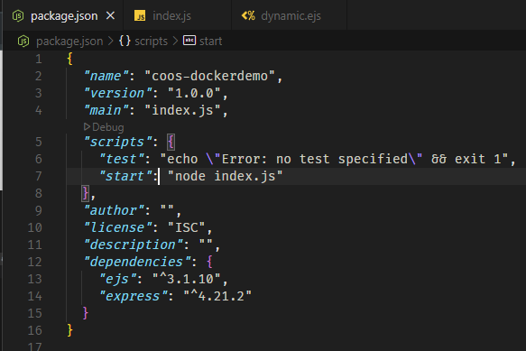
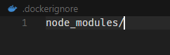
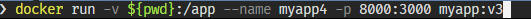

# Computer Organization and Operating System Lab #12

# Section 0: Introduction

## What is Docker


## What is Docker-Compose


Docker Compose เป็นเครื่องมือที่ช่วยให้เราสามารถจัดการและรันแอปพลิเคชันที่ประกอบด้วยหลายๆ คอนเทนเนอร์ได้ง่ายขึ้น โดยเราสามารถกำหนดการตั้งค่าต่างๆ ของคอนเทนเนอร์ในไฟล์เดียวที่เรียกว่า ```docker-compose.yaml```

## What is .YAML


### version (Optional)
```yaml
version: '3'
```
ระบุเวอร์ชันของ Docker Compose ที่เราใช้

### service (Require)

```yaml
services:
  foo:
    image: busybox
    environment:
      - COMPOSE_PROJECT_NAME
    command: echo "I'm running ${COMPOSE_PROJECT_NAME}"
```

 service คือการกำหนดค่าตัวเลือกของคอนเทนเนอร์ที่สร้างขึ้นด้วย Docker Compose  service แต่ละตัวที่ระบุในส่วนนี้จะถูกสร้างเป็นคอนเทนเนอร์ และจะถูกจัดการโดย Docker Compose ในฐานะโปรเจกต์เดียว ชื่อของ service จะถูกกำหนดเป็นรายการย่อยภายใต้หัวข้อ `services` และตัวเลือกของคอนเทนเนอร์จะถูกกำหนดเป็นรายการย่อยภายใต้ชื่อบริการนั้นๆ

# Section 1: Preparation

## Install Docker Desktop
- [Docker Desktop for Window-x86_64](https://docs.docker.com/desktop/setup/install/windows-install/)
- [Docker Desktop for MacOS](https://docs.docker.com/desktop/setup/install/mac-install/)
- [Docker Desktop for Linux](https://docs.docker.com/desktop/setup/install/linux/)

## Install Node.js
- [Node.js](https://nodejs.org/en/download)

## Set Up 

### Docker Desktop
1.  Run Docker Desktop Installer.exe

### Node.js


#### Check Node.js Version
```bash
  node -v
```


#### Check NPM Version
```bash
  npm -v
```


## Section 2: Docker Basics

### 1. Create package.json


### 2. Install Express.js
```bash
  npm i express@latest
```

### 3. Create index.js
```javascript
  const express = require('express');
  const app = express();
  const port = 3000;

  app.get('/', (req, res) => {
    res.send('Hello World!');
  });

  app.listen(port, () => {
    console.log(`Example app listening at http://localhost:${port}`);
  });
```
### 4. Run Node.js Application
```bash
  node index.js
```


### Add script to package.json



### Run Node.js Application with NPM
```bash
  npm run start
```


### 5. Create Dockerfile


### 6. Create .dockerignore



### 7. Build Docker Image


เช็คว่า Image ถูกสร้างขึ้นมาหรือยัง


#### or


### 8. Run Docker Container


### 9. Expose Port


### 10. แสดง Container ที่กำลังทำงานอยู่


### 10. เปลี่ยน index.js and Rebuild Docker Image


### 11. Stop Container


### 12. Remove Container


### 13. Run Docker Container with New Image


### 14. Mount Volume
```docker
docker run -v $(pwd):/app -v $(pwd):/app/node_modules
```

#### $(pwd) คือคำสั่งที่ใช้ในการแสดงตำแหน่งปัจจุบันของไฟล์ หรือ Working Directory ของเรา
#### :/app คือตำแหน่งที่เราต้องการ mount ไปที่ Container


#### Command Prompt อาจจะไม่ไม่ได้ 

### 15. คำสั่งที่ใช้ในการเข้าไปทำงานใน Container


### 16. แก้ insatll nodemon and add script to package.json


### 17. สร้าง Dockerfile.dev


### 18. Build Docker Image with Dockerfile.dev


### 19. Stop All Container And Delete All Container


### 20. Run Docker Container with myapp:v3



