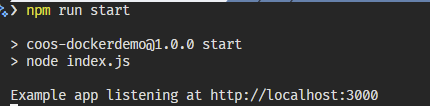
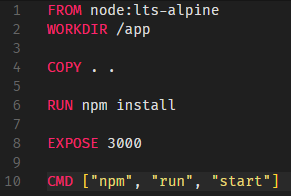
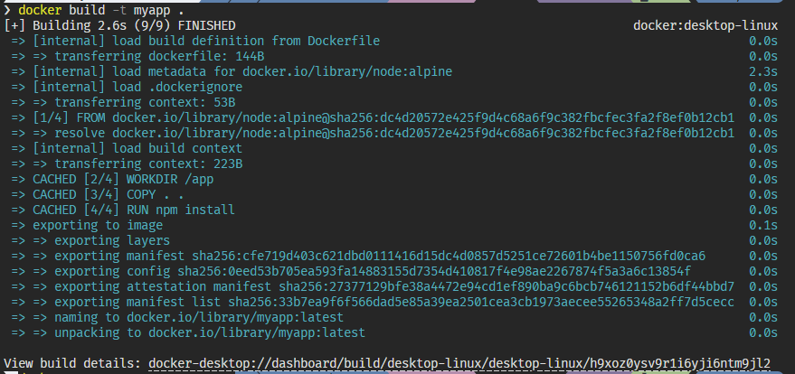
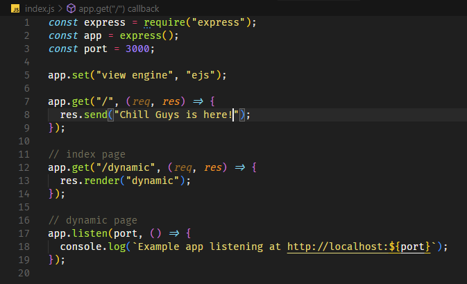
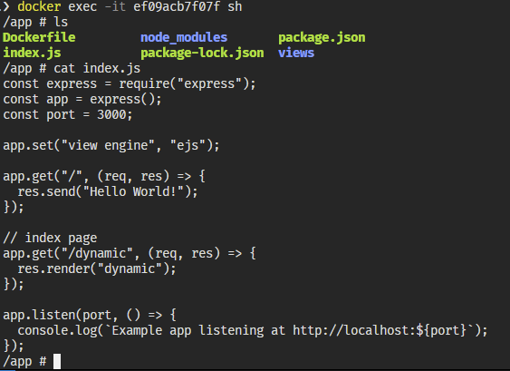

# Computer Organization and Operating System Lab #12

# Section 0: Introduction

## What is Docker


**Docker** เป็นแพลตฟอร์มที่ใช้สำหรับการสร้าง (build), จัดการ (manage), และรัน (run) แอปพลิเคชันในรูปแบบของ "คอนเทนเนอร์" (Container) คอนเทนเนอร์คือหน่วยที่รวมโค้ดของแอป, ไลบรารี, การตั้งค่า และทุกอย่างที่จำเป็นสำหรับการรันแอปนั้นเข้าไว้ด้วยกัน โดยทำงานบนระบบปฏิบัติการ (OS) เดียวกับเครื่องแม่ (host) ทำให้เบาและเร็วกว่าเครื่องเสมือน (Virtual Machine หรือ VM)

เปรียบเทียบง่าย ๆ: Docker เหมือนกล่องที่ใส่ทุกอย่างที่แอปต้องการ (โค้ด, เครื่องมือ, การตั้งค่า) แล้วยกไปรันที่ไหนก็ได้ โดยไม่ต้องกังวลว่าเครื่องนั้นจะต่างกัน

## Docker Compose คืออะไร?


**Docker Compose** เป็นเครื่องมือที่ช่วยให้การจัดการแอปพลิเคชันแบบมัลติคอนเทนเนอร์เป็นเรื่องง่ายและมีประสิทธิภาพมากขึ้น  แทนที่จะต้องใช้คำสั่ง `docker run` หลายครั้งเพื่อเริ่มต้นแต่ละคอนเทนเนอร์  Docker Compose ช่วยให้เราสามารถกำหนดค่าบริการ (service) ต่างๆ ที่ประกอบกันเป็นแอปพลิเคชันของเราได้ในไฟล์เดียวที่เรียกว่า `docker-compose.yaml`  จากนั้นเราสามารถใช้คำสั่ง `docker compose up` เพียงครั้งเดียวเพื่อเริ่มต้นและรันทุกคอนเทนเนอร์ที่กำหนดไว้พร้อมกันได้

**เปรียบเทียบง่าย ๆ:** ถ้า Docker คือเชฟที่ทำอาหารแต่ละจาน, Docker Compose ก็เหมือนผู้จัดการครัวที่จัดการให้เชฟหลายคนทำอาหารหลายๆ อย่าง (เช่น อาหารเรียกน้ำย่อย, อาหารจานหลัก, ของหวาน) และเสิร์ฟทั้งหมดพร้อมกันได้อย่างลงตัว

**Docker Compose V2:** ปัจจุบัน Docker Compose ได้รวมเข้าไปเป็นส่วนหนึ่งของ Docker CLI แล้ว (V2) ทำให้เราสามารถเรียกใช้งานผ่านคำสั่ง `docker compose` แทนที่ `docker-compose` (V1) ได้เลย  ซึ่ง V2 มีประสิทธิภาพที่ดีกว่าและรองรับฟีเจอร์ใหม่ๆ มากขึ้น

## YAML คืออะไร?

**YAML** (ย่อมาจาก "YAML Ain’t Markup Language") เป็นภาษาสำหรับกำหนดข้อมูลที่เน้นความเรียบง่าย อ่านง่าย และเขียนง่ายสำหรับมนุษย์  YAML เหมาะสำหรับการเขียนไฟล์กำหนดค่าต่างๆ เนื่องจากมีโครงสร้างที่ชัดเจนโดยใช้การเยื้อง (indentation) แทนสัญลักษณ์ที่ซับซ้อนอย่าง JSON หรือ XML

ไฟล์ `docker-compose.yaml` เป็นไฟล์ YAML ที่ใช้กำหนดค่าการทำงานของ Docker Compose  โดยทั่วไปจะมีส่วนประกอบหลักๆ ดังนี้:

### `version` (แนะนำให้ระบุเสมอ)

```yaml
version: '3.8' # หรือเวอร์ชันที่สูงกว่า เช่น '3.9', '3.10', '3.11', '3.12'
```

#### อธิบาย:

- `version` ระบุเวอร์ชันของ Docker Compose file format ที่ใช้  ถึงแม้ว่าในปัจจุบัน Docker Compose จะสามารถทำงานได้โดยไม่ระบุ `version` แต่ **ยังคงแนะนำให้ระบุเสมอ** เพื่อ:
    - **ความเข้ากันได้:**  ระบุเวอร์ชันช่วยให้มั่นใจว่า Docker Compose จะตีความไฟล์ของคุณได้อย่างถูกต้อง ไม่ว่าจะเป็น Docker Engine หรือ Docker Compose เวอร์ชันใดก็ตาม
    - **ฟีเจอร์ที่ชัดเจน:**  แต่ละเวอร์ชันของ Compose file format อาจมีฟีเจอร์ใหม่ๆ หรือเปลี่ยนแปลงการทำงานบางอย่าง การระบุเวอร์ชันช่วยให้คุณและทีมงานเข้าใจได้ชัดเจนว่าไฟล์นี้ถูกเขียนขึ้นสำหรับฟีเจอร์ชุดไหน
    - **ความสามารถในการพกพา:**  เมื่อระบุเวอร์ชัน จะทำให้ไฟล์ `docker-compose.yaml` ของคุณสามารถทำงานได้ตามที่คาดหวังบนสภาพแวดล้อม Docker ที่แตกต่างกันมากขึ้น

#### ทำไมต้องมี (และทำไมยังสำคัญ):

- แม้ว่า Docker Compose จะพยายามรองรับไฟล์ที่ไม่มี `version` แต่การไม่ระบุอาจทำให้เกิดพฤติกรรมที่ไม่คาดคิด หรือไม่สามารถใช้ฟีเจอร์ใหม่ๆ ได้
- การระบุ `version` เป็นแนวทางปฏิบัติที่ดีที่สุด (best practice) เพื่อให้มั่นใจถึงความเสถียรและความเข้ากันได้ในระยะยาว

#### หมายเหตุ:

- **เลือกเวอร์ชันที่เหมาะสม:**  โดยทั่วไปควรเลือกเวอร์ชันล่าสุดที่ Docker Engine ของคุณรองรับ  เวอร์ชัน '3.8' ขึ้นไปถือเป็นเวอร์ชันที่ค่อนข้างใหม่และรองรับฟีเจอร์ที่ใช้งานได้หลากหลาย  คุณสามารถตรวจสอบเอกสาร Docker Compose เพื่อดูเวอร์ชันล่าสุดและฟีเจอร์ที่รองรับได้เสมอ
- **เวอร์ชัน `version` ไม่ใช่เวอร์ชัน Docker Compose:**  `version` ใน `docker-compose.yaml` หมายถึงเวอร์ชันของ *ไฟล์ฟอร์แมต* ไม่ใช่เวอร์ชันของ Docker Compose เอง  ดังนั้นการเปลี่ยนเวอร์ชันในไฟล์ไม่ได้หมายถึงการเปลี่ยนเวอร์ชัน Docker Compose ที่คุณใช้

### ตัวอย่าง `services` (จำเป็นต้องมี)

```yaml
services:
  web:
    image: nginx:latest # ระบุ image พร้อม tag :latest เพื่อใช้เวอร์ชันล่าสุด
    ports:
      - "80:80"
    volumes:
      - ./html:/usr/share/nginx/html # Mount volume เพื่อ map โฟลเดอร์ ./html ในเครื่อง host ไปยัง /usr/share/nginx/html ใน container
    networks:
      - app-network # กำหนด network ให้ service นี้

  db:
    image: mysql:8.0 # ระบุ image พร้อมเวอร์ชันที่ต้องการ
    environment:
      MYSQL_ROOT_PASSWORD: secret
      MYSQL_DATABASE: myapp_db
    volumes:
      - db-data:/var/lib/mysql # Named volume สำหรับเก็บข้อมูล database
    networks:
      - app-network

volumes: # กำหนด named volume
  db-data:

networks: # กำหนด network
  app-network:
    driver: bridge # กำหนด driver ของ network (bridge เป็นค่า default)
```

#### อธิบาย:

- `services` เป็นส่วนหลักที่ใช้กำหนดแต่ละคอนเทนเนอร์ (เรียกว่า "service") ที่ Docker Compose จะสร้างและจัดการ  แต่ละ service จะแทนหนึ่งคอนเทนเนอร์ที่ทำงานในแอปพลิเคชันของคุณ

#### โครงสร้างย่อย (ตัวอย่าง):

- `web`:  ชื่อ service สำหรับเว็บเซิร์ฟเวอร์
    - `image`: ระบุ Docker image ที่ใช้สร้างคอนเทนเนอร์ (เช่น `nginx:latest` คือ image Nginx เวอร์ชันล่าสุดจาก Docker Hub)  **ควรระบุ tag ของ image เสมอ** แทนที่จะใช้ `:latest` ใน production เพื่อควบคุมเวอร์ชันของ image ที่ใช้
    - `ports`:  กำหนด port mapping เพื่อเชื่อมต่อ port ของเครื่อง host กับ port ของคอนเทนเนอร์ (รูปแบบ "hostPort:containerPort")  `"80:80"` หมายถึง map port 80 ของ host ไปยัง port 80 ของคอนเทนเนอร์
    - `volumes`:  กำหนด volume เพื่อแชร์ข้อมูลระหว่าง host และคอนเทนเนอร์ หรือระหว่างคอนเทนเนอร์ด้วยกัน
        - **Bind mount:**  `./html:/usr/share/nginx/html` (รูปแบบ `hostPath:containerPath`) คือการ mount โฟลเดอร์ `./html` ในเครื่อง host ไปยัง `/usr/share/nginx/html` ในคอนเทนเนอร์  การเปลี่ยนแปลงไฟล์ในโฟลเดอร์ `./html` จะมีผลในคอนเทนเนอร์ทันที
        - **Named volume:** `db-data:/var/lib/mysql` (รูปแบบ `volumeName:containerPath`) คือการ mount named volume ชื่อ `db-data` ไปยัง `/var/lib/mysql` ในคอนเทนเนอร์  Named volume จัดการโดย Docker และมีความยืดหยุ่นมากกว่า bind mount
    - `networks`:  กำหนด network ที่ service นี้จะเข้าร่วม  `app-network` หมายถึง service `web` จะอยู่ใน network ที่ชื่อ `app-network`

- `db`: ชื่อ service สำหรับ database server (MySQL ในตัวอย่างนี้)
    - `environment`:  กำหนด environment variables ให้กับคอนเทนเนอร์  `MYSQL_ROOT_PASSWORD: secret` และ `MYSQL_DATABASE: myapp_db` คือตัวอย่างการตั้งค่า environment variables สำหรับ MySQL
    - โครงสร้างอื่นๆ คล้ายกับ service `web`

### ส่วนเสริมอื่น ๆ (Optional)

- `volumes`:  ส่วนนี้ใช้กำหนด **named volumes** ที่สามารถนำไปใช้ใน service ต่างๆ ได้  Named volumes ช่วยให้การจัดการ volume เป็นระบบและง่ายต่อการนำกลับมาใช้ใหม่
    - `db-data:`  ประกาศ named volume ชื่อ `db-data`  Docker จะจัดการสร้างและดูแล volume นี้

- `networks`:  ส่วนนี้ใช้กำหนด **networks** ที่คอนเทนเนอร์สามารถเชื่อมต่อถึงกันได้
    - `app-network`:  ประกาศ network ชื่อ `app-network`
        - `driver: bridge`: กำหนด driver ของ network เป็น `bridge` (เป็น driver default)  Docker รองรับ network driver หลายประเภท เช่น `bridge`, `host`, `overlay` เป็นต้น

- `depends_on`: (Optional แต่สำคัญ) ใช้ระบุลำดับการเริ่มต้นของ service  เช่น

```yaml
services:
  web:
    # ...
    depends_on:
      - app # web service จะเริ่มหลังจาก app service เริ่มทำงานแล้ว
  app:
    # ...
    depends_on:
      - db # app service จะเริ่มหลังจาก db service เริ่มทำงานแล้ว
  db:
    # ...
```
  - `depends_on` ช่วยให้มั่นใจว่า service ที่ต้องพึ่งพากันจะเริ่มต้นในลำดับที่ถูกต้อง  ในตัวอย่างนี้ `db` จะเริ่มก่อน, ตามด้วย `app`, และสุดท้ายคือ `web`

- `build`: (Optional) ใช้ build Docker image จาก Dockerfile โดยตรงใน `docker-compose.yaml`

```yaml
services:
  app:
    build:
      context: ./app # โฟลเดอร์ context สำหรับ build image (เช่น โฟลเดอร์ที่มี Dockerfile)
      dockerfile: Dockerfile.dev # ชื่อ Dockerfile (ถ้าไม่ได้ชื่อ Dockerfile)
    # ...
```
  - `build` ช่วยให้คสามารถ build image ของแอปพลิเคชันของคุณได้โดยตรงจาก Docker Compose โดยไม่ต้อง build image แยกต่างหากด้วยคำสั่ง `docker build`

- **อื่น ๆ:** ยังมี options อื่น ๆ อีกมากมายที่สามารถใช้ใน `docker-compose.yaml` เช่น `restart`, `environment_file`, `logging`, `healthcheck`, `deploy` (สำหรับ Docker Swarm)  คุณสามารถศึกษาเพิ่มเติมได้จากเอกสาร Docker Compose อย่างเป็นทางการ

อ่านเพิ่มเติมได้ที่ Docker Compose Reference
[https://docs.docker.com/reference/compose-file/](https://docs.docker.com/reference/compose-file/)


# Section 1: Preparation

## เปิด WSL 2 และ Hyper-V

### &nbsp;&nbsp;&nbsp;✨ให้ใช้ [&nbsp; Batch Script นี้&nbsp;](./scripts/TurnOnHyperV.bat)ในการ เปิด WSL 2 และ Hyper-V โดยจะต้อง Reboot เครื่องเมื่อทำการใช้งาน Script เสร็จแล้ว


## Install Docker Desktop
- [Docker Desktop for Window-x86_64](https://docs.docker.com/desktop/setup/install/windows-install/)
- [Docker Desktop for MacOS](https://docs.docker.com/desktop/setup/install/mac-install/)
- [Docker Desktop for Linux](https://docs.docker.com/desktop/setup/install/linux/)

## Install Node.js
- [Node.js](https://nodejs.org/en/download)

## Set Up 

### Docker Desktop
1.  Run Docker Desktop Installer.exe

### Node.js


#### Check Node.js Version
```bash
  node -v
```


#### Check NPM Version
```bash
  npm -v
```


## Section 2: Docker Basics

### 1. Create package.json
ด้วยคำสั้ง `npm init` และกด Enter เพื่อยืนยันชื่อและข้อมูลต่าง ๆ
```bash
npm init
```


### 2. Install Express.js เวอร์ชั่น 4 และ EJS
```bash
npm i express@4^ ejs  
```

### 3. สร้าง index.js และ ejs views
### โดยมีโครงสร้าง Folder ดังนี้<br/>


#### index.js
```javascript
const express = require("express");
const app = express();
const port = 3000;

app.set("view engine", "ejs");

// index page
app.get("/", (req, res) => {
  res.send("Hello World!");
});

// dynamic page
app.get("/dynamic", (req, res) => {
  res.render("dynamic");
});

app.listen(port, () => {
  console.log(`Example app listening at http://localhost:${port}`);
});
```
#### dynamic.ejs
```html
<!DOCTYPE html>
<html lang="en">
  <head>
    <meta charset="UTF-8" />
    <meta name="viewport" content="width=device-width, initial-scale=1.0" />
    <title>Dynamic Content</title>
  </head>
  <body>
    <h1>Dynamic Content with EJS</h1>
    <h2>Random Number Generator</h2>
    <%= Math.floor(Math.random() * 100) + 1 %>
  </body>
</html>
```

### 4. Run Node.js Application
```bash
node index.js
```


#### index page


#### dynamic page


### เพิ่ม Script สำหรับ Start App ใน package.json


### Run Node.js Application ด้วยคำสั่ง NPM
```bash
npm run start
```


### 5. สร้าง Dockerfile



*   **`FROM node:alpine`**: **ตั้งต้นจาก Image พื้นฐาน:**  ใช้ Docker Image `node:alpine` เป็นฐาน ซึ่งเป็น Image ที่มี Node.js และ npm ติดตั้งไว้แล้ว และใช้ระบบปฏิบัติการ Alpine Linux ที่มีขนาดเล็ก
*   **`WORKDIR /app`**: **กำหนด Working Directory:**  เปลี่ยน Directory ทำงานปัจจุบันภายใน Container ไปที่ `/app`  คำสั่งต่อจากนี้จะทำงานใน Directory นี้
*   **`COPY . .`**: **คัดลอกไฟล์ทั้งหมด:**  คัดลอกไฟล์และโฟลเดอร์ทั้งหมดจาก **current directory** (ที่อยู่ของ Dockerfile) บนเครื่อง Host ไปยัง **`/app`** directory ใน Container
*   **`RUN npm install`**: **ติดตั้ง Dependencies:**  สั่งรันคำสั่ง `npm install` ภายใน Container เพื่อติดตั้ง Node.js dependencies ที่ระบุไว้ใน `package.json` ของโปรเจกต์
*   **`EXPOSE 3000`**: **เปิด Port:**  ประกาศว่า Container จะ Listen บน Port `3000` (เป็นการบอก Docker เฉยๆ ไม่ได้ Publish Port จริงๆ)
*   **`CMD ["npm", "run", "start"]`**: **คำสั่งเริ่มต้น Container:**  กำหนดคำสั่งที่จะรันเมื่อ Container เริ่มทำงาน ในที่นี้คือ `npm run start` ซึ่งมักจะใช้เพื่อสั่งรันแอปพลิเคชัน Node.js (โดย Script `start` ต้องถูกกำหนดไว้ใน `package.json`)


### 6. Create .dockerignore


ทำงานเหมือน `.gitignore` โดยในที่นี่ใส่
```
node_modules/
```
เพื่อไม่ให้คัดลอก node_modules ไปยังคอนเทนเนอร์

### 7. Build Docker Image

> [!WARNING]
> หากพบ Error แบบนี้ กรุณาตรวจสอบว่าเปิด Docker Desktop หรือยัง แล้วลองใหม่ <br/>


`
docker build -t [image-name]:[tag-name] .
`

สร้าง Docker image จาก Dockerfile

`-t myapp:v1` ตั้งชื่อ image ว่า myapp และเวอร์ชัน v1

`.` บอกให้ใช้ไฟล์ในโฟลเดอร์ปัจจุบัน (ที่มี Dockerfile)



เช็คว่า Image ถูกสร้างขึ้นมาหรือยัง


#### or


### 8. ทำการ Run Docker Container


#### อธิบาย:
`
docker run --name [name] [image-name]
`
สร้างและรันคอนเทนเนอร์จาก image ที่เราสร้างไว้


หน้าเว็บไม่สามารถเข้าถึงได้เพราะเรายังไม่ได้เปิดพอร์ต 3000 ในคอนเทนเนอร์

### 9. ทำการ Publish Port เพื่อให้เข้าถึงจากภายนอกได้


<br/>


`docker run -p [host-port]:[container-port] [image-name-with-tag]` บอกให้เปิดพอร์ต 3000 ในเครื่องเรา และเชื่อมกับพอร์ต 3000 ในคอนเทนเนอร์

### 10. แสดง Container ที่กำลังทำงานอยู่


`docker ps` แสดง Container ที่กำลังทำงานอยู่

`docker ps -a` แสดง Container ทั้งหมด

### 10. เปลี่ยน index.js and Rebuild Docker Image



### 11. Stop Container


`docker stop [container-name หรือ container id]` หยุด Container ที่กำลังทำงานอยู่

### 12. Remove Container


`docker rm [container-name]` ลบ Container ที่หยุดทำงานอยู่

### 13. Run Docker Container with New Image


### 14. Mount Volume
`
docker run -v $(pwd):[path-WORKDIR] -v $(pwd):[path-WORKDIR]/node_modules
`

`$(pwd)` คือคำสั่งที่ใช้ในการแสดงตำแหน่งปัจจุบันของไฟล์ หรือ Working Directory ของเรา

`[path-WORKDIR]` คือตำแหน่งที่เราต้องการ mount ไปที่ Container


> [!IMPORTANT]
> ต้องใช้ PowerShell เท่านั้น Command Prompt ใช้งานไม่ได้

### 15. คำสั่งที่ใช้ในการเข้าไปทำงานใน Container (`docker exec`)
สามารถสร้าง shell ใน Continer แบบ Interactive `-it` เพื่อไปแก้ไขหรือทำงานใน Container โดยตรง<br/>

<br/>
`docker exec -it [container-name หรือ container id] sh` เข้าไปทำงานใน Container ด้วย shell `sh`

### 16. ทำการ install nodemon and add script to package.json
```bash
npm i --save-dev nodemon
```
package.json
```json
"dev": "nodemon index.js"
```


### 17. สร้าง Dockerfile.dev


### 18. Build Docker Image with Dockerfile.dev


### 19. Stop All Container And Delete All Container


```bash
docker stop $(docker ps -aq)
docker rm $(docker ps -aq)
```

### 20. Run Docker Container with myapp:v3


