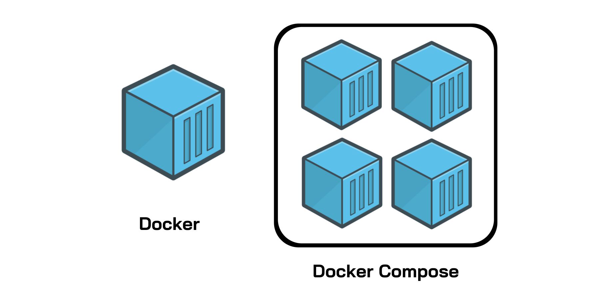

# Docker Compose Lab #13

# Section 0: Introduction

## Docker Compose คืออะไร?


**Docker Compose** เป็นเครื่องมือที่ช่วยให้การจัดการแอปพลิเคชันแบบมัลติคอนเทนเนอร์เป็นเรื่องง่ายและมีประสิทธิภาพมากขึ้น  แทนที่จะต้องใช้คำสั่ง `docker run` หลายครั้งเพื่อเริ่มต้นแต่ละคอนเทนเนอร์  Docker Compose ช่วยให้เราสามารถกำหนดค่าบริการ (service) ต่างๆ ที่ประกอบกันเป็นแอปพลิเคชันของเราได้ในไฟล์เดียวที่เรียกว่า `docker-compose.yaml`  จากนั้นเราสามารถใช้คำสั่ง `docker compose up` เพียงครั้งเดียวเพื่อเริ่มต้นและรันทุกคอนเทนเนอร์ที่กำหนดไว้พร้อมกันได้

**เปรียบเทียบง่าย ๆ:** ถ้า Docker คือเชฟที่ทำอาหารแต่ละจาน, Docker Compose ก็เหมือนผู้จัดการครัวที่จัดการให้เชฟหลายคนทำอาหารหลายๆ อย่าง (เช่น อาหารเรียกน้ำย่อย, อาหารจานหลัก, ของหวาน) และเสิร์ฟทั้งหมดพร้อมกันได้อย่างลงตัว

**Docker Compose V2:** ปัจจุบัน Docker Compose ได้รวมเข้าไปเป็นส่วนหนึ่งของ Docker CLI แล้ว (V2) ทำให้เราสามารถเรียกใช้งานผ่านคำสั่ง `docker compose` แทนที่ `docker-compose` (V1) ได้เลย  ซึ่ง V2 มีประสิทธิภาพที่ดีกว่าและรองรับฟีเจอร์ใหม่ๆ มากขึ้น

## YAML คืออะไร?

**YAML** (ย่อมาจาก "YAML Ain’t Markup Language") เป็นภาษาสำหรับกำหนดข้อมูลที่เน้นความเรียบง่าย อ่านง่าย และเขียนง่ายสำหรับมนุษย์  YAML เหมาะสำหรับการเขียนไฟล์กำหนดค่าต่างๆ เนื่องจากมีโครงสร้างที่ชัดเจนโดยใช้การเยื้อง (indentation) แทนสัญลักษณ์ที่ซับซ้อนอย่าง JSON หรือ XML

ไฟล์ `docker-compose.yaml` เป็นไฟล์ YAML ที่ใช้กำหนดค่าการทำงานของ Docker Compose  โดยทั่วไปจะมีส่วนประกอบหลักๆ ดังนี้:

### `version` (แนะนำให้ระบุเสมอ)

```yaml
version: '3.8' # หรือเวอร์ชันที่สูงกว่า เช่น '3.9', '3.10', '3.11', '3.12'
```

#### อธิบาย:

- `version` ระบุเวอร์ชันของ Docker Compose file format ที่ใช้  ถึงแม้ว่าในปัจจุบัน Docker Compose จะสามารถทำงานได้โดยไม่ระบุ `version` แต่ **ยังคงแนะนำให้ระบุเสมอ** เพื่อ:
    - **ความเข้ากันได้:**  ระบุเวอร์ชันช่วยให้มั่นใจว่า Docker Compose จะตีความไฟล์ของคุณได้อย่างถูกต้อง ไม่ว่าจะเป็น Docker Engine หรือ Docker Compose เวอร์ชันใดก็ตาม
    - **ฟีเจอร์ที่ชัดเจน:**  แต่ละเวอร์ชันของ Compose file format อาจมีฟีเจอร์ใหม่ๆ หรือเปลี่ยนแปลงการทำงานบางอย่าง การระบุเวอร์ชันช่วยให้คุณและทีมงานเข้าใจได้ชัดเจนว่าไฟล์นี้ถูกเขียนขึ้นสำหรับฟีเจอร์ชุดไหน
    - **ความสามารถในการพกพา:**  เมื่อระบุเวอร์ชัน จะทำให้ไฟล์ `docker-compose.yaml` ของคุณสามารถทำงานได้ตามที่คาดหวังบนสภาพแวดล้อม Docker ที่แตกต่างกันมากขึ้น

#### ทำไมต้องมี (และทำไมยังสำคัญ):

- แม้ว่า Docker Compose จะพยายามรองรับไฟล์ที่ไม่มี `version` แต่การไม่ระบุอาจทำให้เกิดพฤติกรรมที่ไม่คาดคิด หรือไม่สามารถใช้ฟีเจอร์ใหม่ๆ ได้
- การระบุ `version` เป็นแนวทางปฏิบัติที่ดีที่สุด (best practice) เพื่อให้มั่นใจถึงความเสถียรและความเข้ากันได้ในระยะยาว

#### หมายเหตุ:

- **เลือกเวอร์ชันที่เหมาะสม:**  โดยทั่วไปควรเลือกเวอร์ชันล่าสุดที่ Docker Engine ของคุณรองรับ  เวอร์ชัน '3.8' ขึ้นไปถือเป็นเวอร์ชันที่ค่อนข้างใหม่และรองรับฟีเจอร์ที่ใช้งานได้หลากหลาย  คุณสามารถตรวจสอบเอกสาร Docker Compose เพื่อดูเวอร์ชันล่าสุดและฟีเจอร์ที่รองรับได้เสมอ
- **เวอร์ชัน `version` ไม่ใช่เวอร์ชัน Docker Compose:**  `version` ใน `docker-compose.yaml` หมายถึงเวอร์ชันของ *ไฟล์ฟอร์แมต* ไม่ใช่เวอร์ชันของ Docker Compose เอง  ดังนั้นการเปลี่ยนเวอร์ชันในไฟล์ไม่ได้หมายถึงการเปลี่ยนเวอร์ชัน Docker Compose ที่คุณใช้

### ตัวอย่าง `services` (จำเป็นต้องมี)

```yaml
services:
  web:
    image: nginx:latest # ระบุ image พร้อม tag :latest เพื่อใช้เวอร์ชันล่าสุด
    ports:
      - "80:80"
    volumes:
      - ./html:/usr/share/nginx/html # Mount volume เพื่อ map โฟลเดอร์ ./html ในเครื่อง host ไปยัง /usr/share/nginx/html ใน container
    networks:
      - app-network # กำหนด network ให้ service นี้

  db:
    image: mysql:8.0 # ระบุ image พร้อมเวอร์ชันที่ต้องการ
    environment:
      MYSQL_ROOT_PASSWORD: secret
      MYSQL_DATABASE: myapp_db
    volumes:
      - db-data:/var/lib/mysql # Named volume สำหรับเก็บข้อมูล database
    networks:
      - app-network

volumes: # กำหนด named volume
  db-data:

networks: # กำหนด network
  app-network:
    driver: bridge # กำหนด driver ของ network (bridge เป็นค่า default)
```

#### อธิบาย:

- `services` เป็นส่วนหลักที่ใช้กำหนดแต่ละคอนเทนเนอร์ (เรียกว่า "service") ที่ Docker Compose จะสร้างและจัดการ  แต่ละ service จะแทนหนึ่งคอนเทนเนอร์ที่ทำงานในแอปพลิเคชันของคุณ

#### โครงสร้างย่อย (ตัวอย่าง):

- `web`:  ชื่อ service สำหรับเว็บเซิร์ฟเวอร์
    - `image`: ระบุ Docker image ที่ใช้สร้างคอนเทนเนอร์ (เช่น `nginx:latest` คือ image Nginx เวอร์ชันล่าสุดจาก Docker Hub)  **ควรระบุ tag ของ image เสมอ** แทนที่จะใช้ `:latest` ใน production เพื่อควบคุมเวอร์ชันของ image ที่ใช้
    - `ports`:  กำหนด port mapping เพื่อเชื่อมต่อ port ของเครื่อง host กับ port ของคอนเทนเนอร์ (รูปแบบ "hostPort:containerPort")  `"80:80"` หมายถึง map port 80 ของ host ไปยัง port 80 ของคอนเทนเนอร์
    - `volumes`:  กำหนด volume เพื่อแชร์ข้อมูลระหว่าง host และคอนเทนเนอร์ หรือระหว่างคอนเทนเนอร์ด้วยกัน
        - **Bind mount:**  `./html:/usr/share/nginx/html` (รูปแบบ `hostPath:containerPath`) คือการ mount โฟลเดอร์ `./html` ในเครื่อง host ไปยัง `/usr/share/nginx/html` ในคอนเทนเนอร์  การเปลี่ยนแปลงไฟล์ในโฟลเดอร์ `./html` จะมีผลในคอนเทนเนอร์ทันที
        - **Named volume:** `db-data:/var/lib/mysql` (รูปแบบ `volumeName:containerPath`) คือการ mount named volume ชื่อ `db-data` ไปยัง `/var/lib/mysql` ในคอนเทนเนอร์  Named volume จัดการโดย Docker และมีความยืดหยุ่นมากกว่า bind mount
    - `networks`:  กำหนด network ที่ service นี้จะเข้าร่วม  `app-network` หมายถึง service `web` จะอยู่ใน network ที่ชื่อ `app-network`

- `db`: ชื่อ service สำหรับ database server (MySQL ในตัวอย่างนี้)
    - `environment`:  กำหนด environment variables ให้กับคอนเทนเนอร์  `MYSQL_ROOT_PASSWORD: secret` และ `MYSQL_DATABASE: myapp_db` คือตัวอย่างการตั้งค่า environment variables สำหรับ MySQL
    - โครงสร้างอื่นๆ คล้ายกับ service `web`

### ส่วนเสริมอื่น ๆ (Optional)

- `volumes`:  ส่วนนี้ใช้กำหนด **named volumes** ที่สามารถนำไปใช้ใน service ต่างๆ ได้  Named volumes ช่วยให้การจัดการ volume เป็นระบบและง่ายต่อการนำกลับมาใช้ใหม่
    - `db-data:`  ประกาศ named volume ชื่อ `db-data`  Docker จะจัดการสร้างและดูแล volume นี้

- `networks`:  ส่วนนี้ใช้กำหนด **networks** ที่คอนเทนเนอร์สามารถเชื่อมต่อถึงกันได้
    - `app-network`:  ประกาศ network ชื่อ `app-network`
        - `driver: bridge`: กำหนด driver ของ network เป็น `bridge` (เป็น driver default)  Docker รองรับ network driver หลายประเภท เช่น `bridge`, `host`, `overlay` เป็นต้น

- `depends_on`: (Optional แต่สำคัญ) ใช้ระบุลำดับการเริ่มต้นของ service  เช่น

```yaml
services:
  web:
    # ...
    depends_on:
      - app # web service จะเริ่มหลังจาก app service เริ่มทำงานแล้ว
  app:
    # ...
    depends_on:
      - db # app service จะเริ่มหลังจาก db service เริ่มทำงานแล้ว
  db:
    # ...
```
- `depends_on` ช่วยให้มั่นใจว่า service ที่ต้องพึ่งพากันจะเริ่มต้นในลำดับที่ถูกต้อง  ในตัวอย่างนี้ `db` จะเริ่มก่อน, ตามด้วย `app`, และสุดท้ายคือ `web`

- `build`: (Optional) ใช้ build Docker image จาก Dockerfile โดยตรงใน `docker-compose.yaml`

```yaml
services:
  app:
    build:
      context: ./app # โฟลเดอร์ context สำหรับ build image (เช่น โฟลเดอร์ที่มี Dockerfile)
      dockerfile: Dockerfile.dev # ชื่อ Dockerfile (ถ้าไม่ได้ชื่อ Dockerfile)
    # ...
```
- `build` ช่วยให้คสามารถ build image ของแอปพลิเคชันของคุณได้โดยตรงจาก Docker Compose โดยไม่ต้อง build image แยกต่างหากด้วยคำสั่ง `docker build`

- **อื่น ๆ:** ยังมี options อื่น ๆ อีกมากมายที่สามารถใช้ใน `docker-compose.yaml` เช่น `restart`, `environment_file`, `logging`, `healthcheck`, `deploy` (สำหรับ Docker Swarm)  คุณสามารถศึกษาเพิ่มเติมได้จากเอกสาร Docker Compose อย่างเป็นทางการ

อ่านเพิ่มเติมได้ที่ Docker Compose Reference
[https://docs.docker.com/reference/compose-file/](https://docs.docker.com/reference/compose-file/)