# Kubernetes Lab #14

# Section 0: Introduction

# Section 1: Preparation

Install Minikube

[Link Install Minikube](https://minikube.sigs.k8s.io/docs/start/?arch=%2Fwindows%2Fx86-64%2Fstable%2F.exe+download)

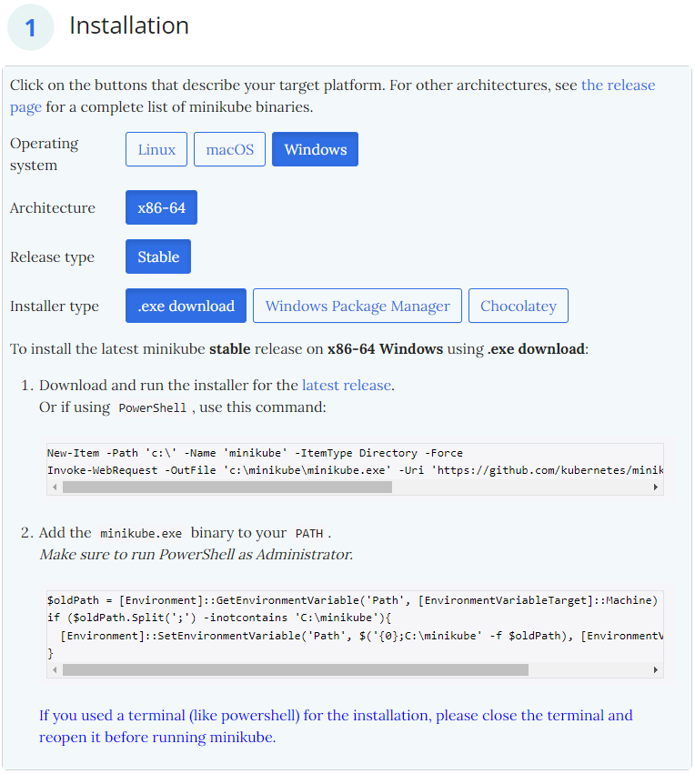

# Section 2: Start Kubernetes


# Section 3: MiniKube

## 3.1: Start MiniKube

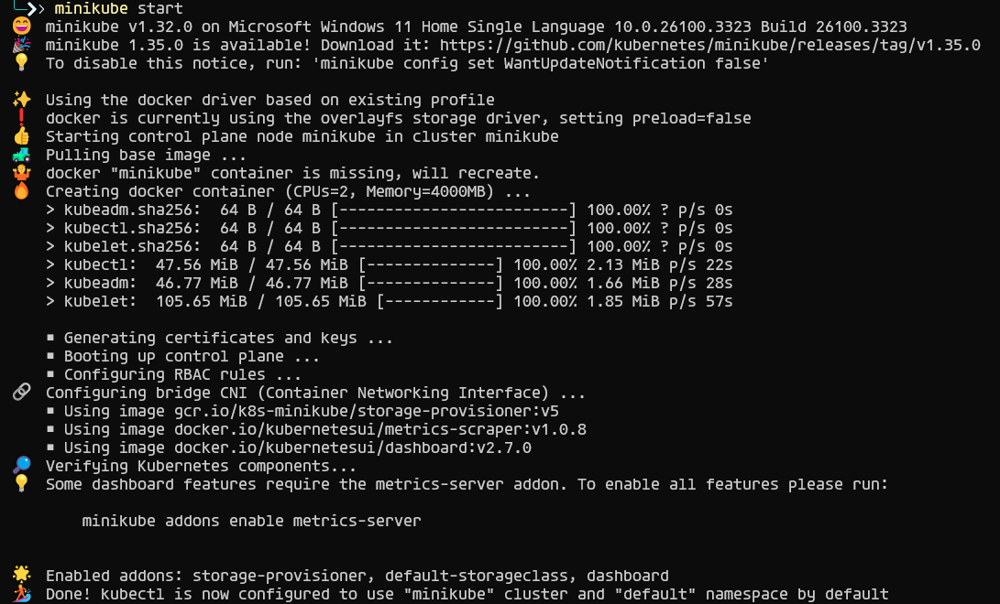

## 3.2: Check Kubectl nodes

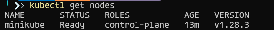

## 3.3: Check Kubectl pods

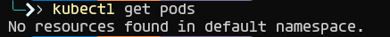

## 3.4 MiniKube Dashboard

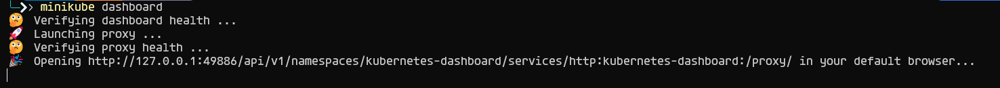
### Click on ```Namespace``` on the left panel
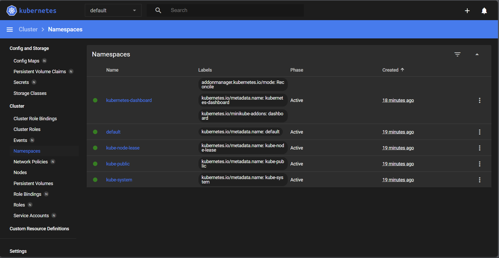

## 3.5 Create Sample application

### Create a application
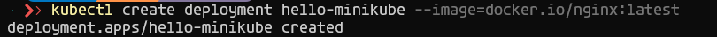

### Expose the application in port 80


### Check the application
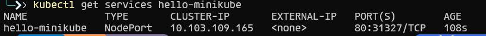

## 3.6 Launch the service name ```balanced```

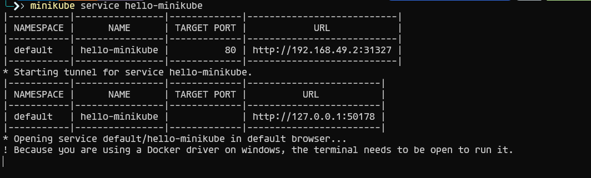
Ctrl + c to terminate the service

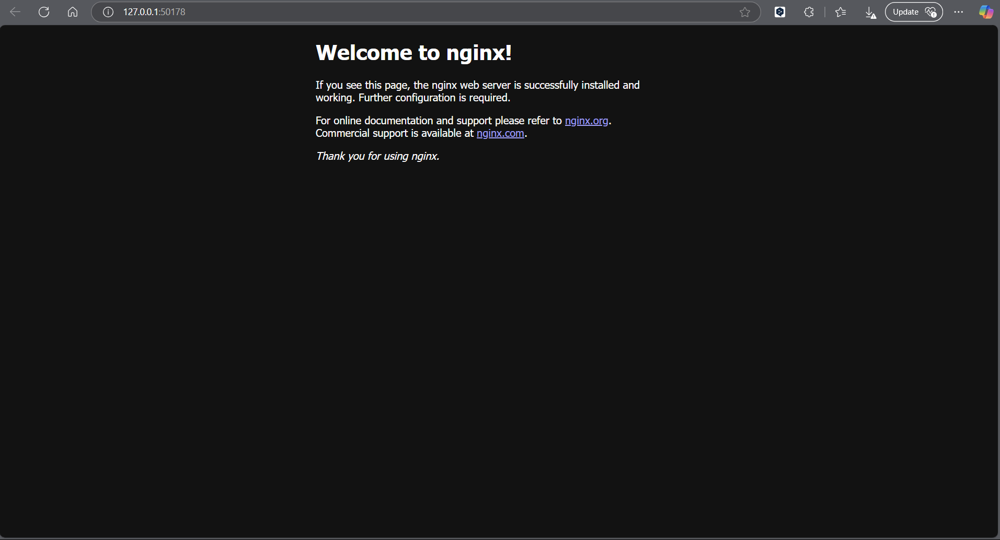


## 3.7 Load Balancer deployment
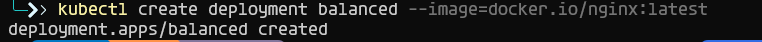

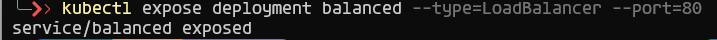

## 3.7 minikube tunnel
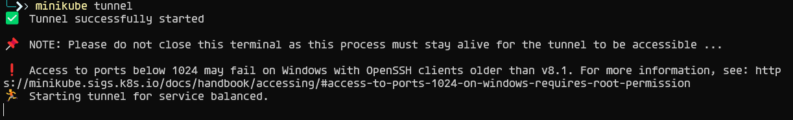

### To know the external IP of service ```balanced```

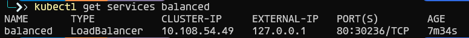


## 3.8 Show all  pods in the cluster

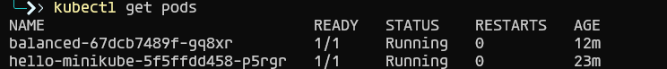

## 3.9 Show all  nodes in the cluster

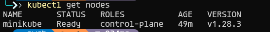

## 3.10 Show all namespaces

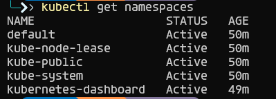

## 3.11 Show all deployments

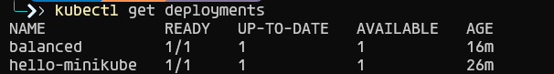

## 3.12 Show all services


## Show cluster info

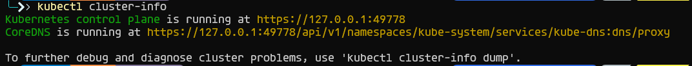

## Show staus of the cluster

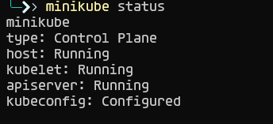

## List the event log 

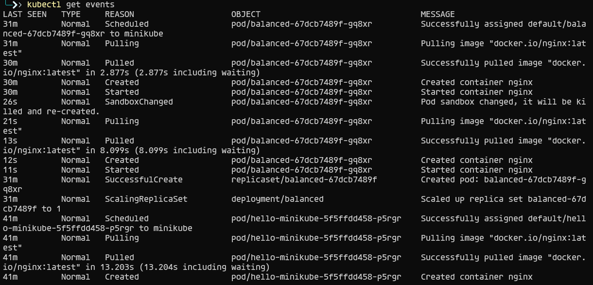

## Pause the cluster


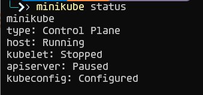

## Resume the cluster

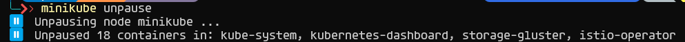

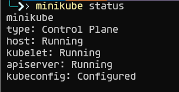

## Stop the cluster

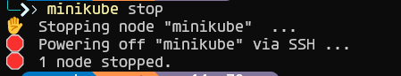

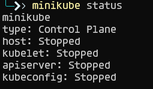

## update activate context

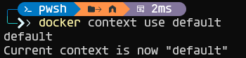


# Section 4: Uninstall Minikube

```shell
minikube stop
```

```shell
miniube delete
```
## Delete the ```.minikube``` and ```.kube``` folder

```shell
C:\Users\{user}\.minikube (rm $HOME/.minikube)
```

```shell
C:\Users\{user}\.kube (rm $HOME/.kube)
```

## Delete All the images (IT WILL DELETE ALL THE IMAGES)

```shell
docker rmi -f $(docker images -aq)
```


