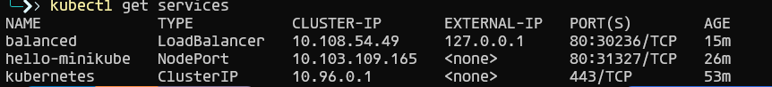

# Kubernetes Lab #14

<p align="center">

</p>

## Section 0: บทนำ

เอกสารปฏิบัตการนี้จะแนะนำการใช้งาน Kubernetes เบื้องต้นบน Windows โดยเน้นที่การใช้ Docker Desktop และ Minikube เพื่อให้ง่ายต่อการเริ่มต้น ผู้เรียนจะได้เรียนรู้:

*   การติดตั้งและตั้งค่า Kubernetes
*   การใช้งาน `kubectl` ซึ่งเป็นเครื่องมือหลักในการจัดการ Kubernetes
*   การสร้างและ deploy แอปพลิเคชันอย่างง่าย
*   การใช้ Minikube Dashboard
*   คำสั่งพื้นฐานสำหรับการดูแลระบบ Kubernetes

## Section 1: การเตรียมการ

### 1.1 ข้อกำหนดเบื้องต้น (Requirement)

ก่อนเริ่มปฏิบัติการนี้ ตรวจสอบให้แน่ใจว่าได้ติดตั้ง Docker Desktop ตามเอกสารปฏิบัติการ [Lab Week 13 - Containerization with Docker](/Week%2013%20-%20Containerization%20with%20Docker/) เรียบร้อยแล้ว หากใช้คอมพิวเตอร์ในห้อง Lab 304 ควรจะสามารถใช้งานได้ทันที


### 1.2 เปิดใช้งาน Kubernetes ใน Docker Desktop

**ขั้นตอน:**

1.  เปิด Docker Desktop และไปที่หน้า Settings (รูปเฟือง)
2.  คลิกที่แท็บ "Kubernetes"
3.  ทำเครื่องหมายถูกที่ "Enable Kubernetes" การทำเช่นนี้จะเป็นการติดตั้ง Kubernetes แบบโหนดเดียว (Standalone) ซึ่งเหมาะสำหรับการเรียนรู้และพัฒนา


#### 1.2.1 ติดตั้ง Kubernetes Cluster

หลังจากเปิดใช้งานแล้ว ให้คลิก "Apply & restart" จากนั้น Docker Desktop จะทำการติดตั้ง Kubernetes Cluster ให้


#### 1.2.2 ตรวจสอบการติดตั้ง Kubernetes

เมื่อติดตั้งเสร็จสมบูรณ์ จะเห็นไอคอน Kubernetes เป็นสีเขียว (พร้อมกับไอคอน Docker) ที่มุมซ้ายล่างของ Docker Desktop ซึ่งแสดงว่า Kubernetes พร้อมใช้งานแล้ว


#### 1.2.3 ตรวจสอบการติดตั้ง `kubectl`

Docker Desktop เวอร์ชันปัจจุบันมักจะติดตั้ง `kubectl` มาให้แล้ว ให้ทดสอบโดยการเปิด Terminal (เช่น Command Prompt หรือ PowerShell) แล้วพิมพ์คำสั่ง `kubectl` หากทุกอย่างถูกต้อง จะมีข้อความช่วยเหลือ (verbose screen) แสดงขึ้นมา


หากไม่พบการติดตั้ง `kubectl` ให้ติดตั้งด้วยตนเองตามคำแนะนำจากเว็บไซต์ [https://kubernetes.io/docs/tasks/tools/](https://kubernetes.io/docs/tasks/tools/)

### 1.3 ติดตั้ง Minikube

Minikube เป็นเครื่องมือที่ช่วยให้สามารถรัน Kubernetes cluster แบบโหนดเดียวบนเครื่องคอมพิวเตอร์ส่วนตัวได้ง่าย เหมาะสำหรับการเรียนรู้และทดสอบ

สามารถดาวน์โหลด Minikube Setup ได้ที่นี่: [Minikube Setup Download](https://minikube.sigs.k8s.io/docs/start/?arch=%2Fwindows%2Fx86-64%2Fstable%2F.exe+download)

#### 1.3.1 ติดตั้งผ่าน WinGet (Windows Package Manager)

```powershell
winget install Kubernetes.minikube
```


#### 1.3.2 ติดตั้งผ่าน Chocolatey

```powershell
choco install minikube
```


> [!IMPORTANT]
> หลังจากติดตั้ง Minikube เสร็จแล้ว **อย่าลืมปิด Terminal แล้วเปิดใหม่** เพื่อให้ระบบโหลด Environment PATH ใหม่ มิฉะนั้นอาจจะหาคำสั่ง `minikube` ไม่พบ
> 

## Section 2: เริ่มต้นใช้งาน Kubernetes

### 2.1 ตรวจสอบ Kubernetes Cluster

ตรวจสอบว่า `kubectl` กำลังเชื่อมต่อกับ Kubernetes cluster ใดอยู่ด้วยคำสั่ง:

```powershell
kubectl config current-context
```

ผลลัพธ์ควรแสดง `docker-desktop` ซึ่งหมายความว่าคุณกำลังใช้ Kubernetes ที่มาพร้อมกับ Docker Desktop

## Section 3: Minikube

### 3.1 เริ่มต้นใช้งาน Minikube

เริ่มต้นใช้งาน Minikube cluster ด้วยคำสั่ง:

```powershell
minikube start
```

Minikube จะดาวน์โหลดแพ็กเกจและไลบรารีที่จำเป็น (อาจใช้เวลาสักครู่ ขึ้นอยู่กับความเร็วอินเทอร์เน็ต)


### 3.2 ตรวจสอบโหนด (Nodes)

ตรวจสอบจำนวนโหนดใน Kubernetes cluster ด้วยคำสั่ง:

```powershell
kubectl get nodes
```


### 3.3 ตรวจสอบ Pods
ตรวจสอบ pod ด้วยคำสั่ง (ตอนนี้จะยังไม่มี pod)
```powershell
kubectl get pods
```


### 3.4 Minikube Dashboard

Minikube Dashboard เป็นเว็บอินเตอร์เฟสที่แสดงข้อมูลและสถานะของ cluster อย่างละเอียด

**เปิด Dashboard ด้วยคำสั่ง:**

```powershell
minikube dashboard
```


เบราว์เซอร์จะเปิดหน้า Kubernetes Dashboard ขึ้นมา คลิกที่ "Namespaces" ทางด้านซ้าย เพื่อดูข้อมูล namespaces


## 3.5 สร้างแอปพลิเคชันตัวอย่าง

ในส่วนนี้ เราจะสร้างแอปพลิเคชันตัวอย่าง (nginx) และ deploy บน Kubernetes cluster

**สร้าง Deployment:**

```powershell
kubectl create deployment hello-minikube --image=docker.io/nginx:latest
```


**เปิดให้เข้าถึงแอปพลิเคชัน (Expose):**

```powershell
kubectl expose deployment hello-minikube --type=NodePort --port=80
```


**ตรวจสอบ Service:**

```powershell
kubectl get services hello-minikube
```

จะเห็นว่า Kubernetes กำหนด IP ภายใน (internal IP) และ port mapping ให้


## 3.6 Load Balancer

เปิด service ด้วยคำสั่ง:

```powershell
minikube service hello-minikube
```

จะมีตารางแสดง namespace, ชื่อ, target port และ URL ของ service


สามารถกด `Ctrl + C` เพื่อหยุดการทำงาน

เบราว์เซอร์จะเปิดหน้าเว็บเริ่มต้นของ nginx ขึ้นมา


## 3.7 LoadBalancer Deployment

สร้าง LoadBalancer deployment ชื่อ `balanced`:

```powershell
kubectl create deployment balanced --image=docker.io/nginx:latest
kubectl expose deployment balanced --type=LoadBalancer --port=80
```


## 3.8 minikube tunnel

สร้าง routable IP: ใช้คำสั่ง `minikube tunnel` ใน PowerShell *อีกหน้าต่างหนึ่ง*

**สำคัญ:** ต้องเปิดหน้าต่างนี้ทิ้งไว้ เพื่อให้ tunnel ทำงานได้


### ตรวจสอบ External IP

ตรวจสอบ External IP ของ service `balanced` ด้วยคำสั่ง:

```powershell
minikube get services balanced
```
โดยสามารถเข้าถึง Deployment ได้ด้วย `http://<External IP>:80`


## Section 4: คำสั่งดูแลระบบ (Administrative Commands)

ส่วนนี้จะแนะนำคำสั่ง `kubectl` ที่ใช้บ่อยสำหรับการดูแลระบบ Kubernetes

### 4.1 แสดง Pod ทั้งหมด

```powershell
kubectl get pods
```


### 4.2 แสดง Node ทั้งหมด

```powershell
kubectl get nodes
```


### 4.3 แสดง Namespace ทั้งหมด

```powershell
kubectl get namespaces
```


### 4.4 แสดง Deployment ทั้งหมด

```powershell
kubectl get deployments
```


### 4.5 แสดง Service ทั้งหมด

```powershell
kubectl get services
```



### 4.6 แสดงข้อมูล Cluster

```powershell
kubectl cluster-info
```


### 4.7 แสดงสถานะ Cluster

```powershell
minikube status
```


### 4.8 แสดงบันทึกเหตุการณ์ (Event Log)

```powershell
kubectl get events
```


### 4.9 หยุด Cluster ชั่วคราว

```powershell
minikube pause
```


### 4.10 เริ่ม Cluster ที่หยุดไว้

```powershell
minikube unpause
```


### 4.11 หยุด Cluster

```powershell
minikube stop
```


### 4.12 อัปเดต Active Context
```
docker context use default
```


# Section 5: การถอนการติดตั้ง Minikube

```powershell
minikube stop
```

```powershell
minikube delete
```

## ลบโฟลเดอร์ `.minikube` และ `.kube`

```powershell
C:\Users\{user}\.minikube (rm $HOME/.minikube)
```

```powershell
C:\Users\{user}\.kube (rm $HOME/.kube)
```

## ลบ Images ทั้งหมด (คำเตือน: คำสั่งนี้จะลบ Images ทั้งหมด)

```powershell
docker rmi -f $(docker images -aq)
```
